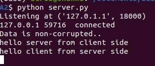
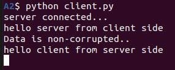

## Lab assignment 2 
* I have created a chatting interface between server and client with a little difference.
* Whenver any one send a message the other party displays the message as well as the confirmation that the data is not corrupted.
* Both parties are encrypting as well as decrypting the message.
* I have created a separate file for handling the encryption.
* I am using a 4x4 coding matrix for encryption.
* I am using ascii as a mapping function of the letters.
* The default bit conversion of ascii numbers is in 8 bit format since the ascii of any letter cannot exceed 255.
* I have set the default port and ip so we can just run the both server.py and client.py file.

# Working:
* I am using the mapping table as the ascii itself.
* After translation of characters to their ascii, I am converting them to 8bit format and then appending every number.
* Then I am calculating crc of this whole binary value.
* The translated matrix is now encrypted using cipher matrix.
* The encrypted matrix is then converted to comma separated numbers and appended with the crc at the end with comma.
* In reciever I am splitting the string by comma then taking out the last element which is crc.
* The rest of the list is reshaped to matrix and then is decrypted using inverse of cipher matrix.
* The now decrypted matrix is again converted to 8bit format and crc is calculated and matched to recieved crc.
* Then the decrypted matrix is reversed back to its letter form. 
* Then the text is printed along with crc status.

